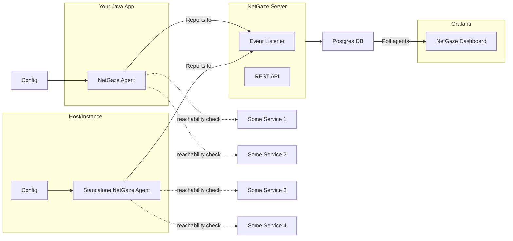

# NetGaze

<p align="center">

</p>


NetGaze is a network observability platform designed for server-side network observability for
microservices. It provides real-time monitoring and visualization of network connectivity, enabling you to identify
failure points, network issues, and service dependencies.

**NOTE**: This project is a work in progress.

## Design



## Features

- Standalone service for machine status notification
- Integration with Spring Boot apps for app status notification
- Network connectivity setup with other dependent services
- Definition of targets for reachability checks
- Visualization of service connections and network issues

## Installation

### Server

#### Run the NetGaze Server

```shell
java \
  -jar netgaze-server.jar \
  --spring.config.location=/path/to/config.yaml
```

#### Run as a Docker container

##### Using default config

```shell
docker run \
  -p 8080:8080 \
  ghcr.io/netgaze/netgaze:0.0.1
```

##### Use an external config file

Use

```shell
docker run \
  -p 8080:8080 \
  -v /path/to/your/config.yaml:/app/config.yaml
  ghcr.io/netgaze/netgaze:0.0.1
```

Refer to the
sample [config.yaml](https://github.com/NetGaze/blob/main/server/src/main/resources/application.yaml).

After running the above command:

- NetGaze server's UI is accessible at http://localhost:8080 (when default config.yaml is used.).
- NetGaze server's REST API playground is accessible at http://localhost:8080/docs (when default config.yaml is used).
- NetGaze server's event listener (socket server) would be started on the same web port for the stomp clients to
  connect at `ws://localhost:8080/netgaze-agent-event-listener`

Verify if the event listener port is accessible.

```shell
telnet localhost 8990
```

### Client

#### Case 1: Using it in Java App

Added as lib in Java and configured to connect to a few services (database, another Java app, REST
API, etc).
The lib does a reachability check to all the services, collects the data and reports to the master.

To use NetGaze in your Java application, follow these steps:

1. Add the NetGaze Agent dependency to your project's `pom.xml`:

```xml

<dependency>
    <groupId>io.github.netgaze</groupId>
    <artifactId>netgaze-agent</artifactId>
    <version>0.0.1</version>
</dependency>
```

2. Add repository to your project's `pom.xml`:

```xml

<repositories>
    <repository>
        <id>github</id>
        <name>GitHub Apache Maven Packages</name>
        <url>https://maven.pkg.github.com/NetGaze</url>
        <releases>
            <enabled>true</enabled>
        </releases>
        <snapshots>
            <enabled>true</enabled>
        </snapshots>
    </repository>
</repositories>
```

3. Add server to `settings.xml`. (Usually available at `~/.m2/settings.xml`)

```xml

<settings xmlns="http://maven.apache.org/SETTINGS/1.0.0"
          xmlns:xsi="http://www.w3.org/2001/XMLSchema-instance"
          xsi:schemaLocation="http://maven.apache.org/SETTINGS/1.0.0
                      http://maven.apache.org/xsd/settings-1.0.0.xsd">
    <servers>
        <server>
            <id>github</id>
            <username>your-github-username</username>
            <password>your-github-token</password>
        </server>
    </servers>
</settings>
```

4. Create your config file `agent-config.yaml`:

```yaml
name: Test Agent
host: 192.188.10.1
connections:
  - name: Google
    description: Connection to Google
    type: HTTP
    host: google.com
    port: 80
  - name: Facebook
    description: Connection to Facebook
    type: HTTP
    host: facebook.com
    port: 80
```

5. Configure NetGaze Agent in your Java application:

```java
import io.github.netgaze.client.NetGazeAgent;

import java.util.Collections;

public class Main {

    public static void main(String[] args) {
        NetGazeAgent netGazeAgent = new NetGazeAgent(
                "localhost",
                8080,
                "/path/to/agent-config.yaml"
        );

        // this starts NetGaze agent in the background

        netGazeAgent.start();

        netGazeAgent.join();
    }
}
```

#### Case 2: Using it as a standalone agent

The agent does a reachability check to all the configured services, collects the data and reports to
the master.

**This capability is TBD.**

### Visualize

Visualize in Grafana

http://localhost:3000/dashboards


### Development

#### Build

```shell
mvn clean install
```

Once NetGaze is integrated into your application, it will automatically post heartbeat messages to
notify the status of
your machine and application.
You can visualize this data using the NetGaze dashboard to identify any failure points or network
connectivity issues.

## Todo

- [ ] Python agent
- [ ] Threaded connection watcher - `io.github.netgaze.client.Collector`
- [ ] Docker container for NetGaze server
- [ ] UI improvements
- [ ] Docs setup with Docusaurus

## Contributing

Contributions to NetGaze are welcome! If you have any ideas for new features, improvements, or bug
fixes, please open
an issue or submit a pull request on GitHub.

