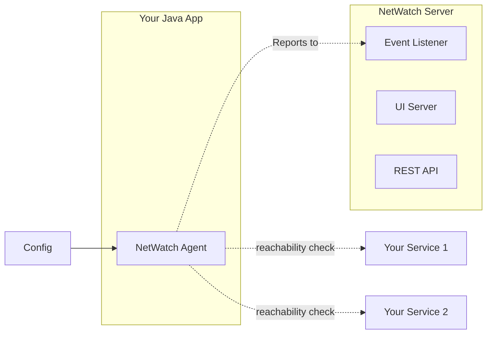

# NetWatch


NetWatch is a Java-based library/agent designed for server-side network observability for
microservices. It provides real-time
monitoring and visualization of network connectivity, enabling you to identify and address issues
proactively.

**NOTE**: This project is a work in progress.

## Design



## Features

- Standalone service for machine status notification
- Integration with Spring Boot apps for app status notification
- Network connectivity setup with other dependent services
- Definition of targets for reachability checks
- Visualization of service connections and network issues

## Installation

### Server

#### Run the NetWatch Server

```shell
java -jar netwatch-server.jar --spring.config.location=/path/to/config.yaml
```

Refer to the
sample [config.yaml](https://github.com/amithkoujalgi/NetWatch/blob/main/server/src/main/resources/application.yaml).

After running the above command:

- NetWatch server's UI is accessible at http://localhost:8080 (when default config.yaml is used.).
- NetWatch server's REST API playground is accessible at http://localhost:8080/docs (when default config.yaml is used).
- NetWatch server's event listener would be started on port 8990 (when default config.yaml is used).

Verify if the event listener port is accessible.

```shell
telnet localhost 8990
```

### Client

#### Case 1: Using it in Java App

Added as lib in Java and configured to connect to a few services (database, another Java app, REST
API, etc).
The lib does a reachability check to all the services, collects the data and reports to the master.

To use NetWatch in your Java application, follow these steps:

1. Add the NetWatch Agent dependency to your project's `pom.xml`:

```xml

<dependency>
    <groupId>io.github.amithkoujalgi</groupId>
    <artifactId>netwatch-agent</artifactId>
    <version>0.0.1</version>
</dependency>
```

2. Add repository to your project's `pom.xml`:

```xml

<repositories>
    <repository>
        <id>github</id>
        <name>GitHub Apache Maven Packages</name>
        <url>https://maven.pkg.github.com/amithkoujalgi/NetWatch</url>
        <releases>
            <enabled>true</enabled>
        </releases>
        <snapshots>
            <enabled>true</enabled>
        </snapshots>
    </repository>
</repositories>
```

3. Add server to `settings.xml`. (Usually available at `~/.m2/settings.xml`)

```xml

<settings xmlns="http://maven.apache.org/SETTINGS/1.0.0"
          xmlns:xsi="http://www.w3.org/2001/XMLSchema-instance"
          xsi:schemaLocation="http://maven.apache.org/SETTINGS/1.0.0
                      http://maven.apache.org/xsd/settings-1.0.0.xsd">
    <servers>
        <server>
            <id>github</id>
            <username>your-github-username</username>
            <password>your-github-token</password>
        </server>
    </servers>
</settings>
```

4. Create your config file `agent-config.yaml`:

```yaml
name: Test Agent
host: 192.188.10.1
connections:
  - name: Google
    description: Connection to Google
    type: HTTP
    host: google.com
    port: 80
  - name: Facebook
    description: Connection to Facebook
    type: HTTP
    host: facebook.com
    port: 80
```

5. Configure NetWatch Agent in your Java application:

```java
import io.github.amithkoujalgi.netwatch.client.NetWatchAgent;

import java.util.Collections;

public class Main {

    public static void main(String[] args) {
        NetWatchAgent netWatchAgent = new NetWatchAgent(
                "localhost",
                8080,
                "/path/to/agent-config.yaml"
        );
        
        // this starts NetWatch agent in the background
        
        netWatchAgent.start();
        
        netWatchAgent.join();
    }
}
```

#### Case 2: Using it as a standalone agent

The agent does a reachability check to all the configured services, collects the data and reports to
the master.

**This capability is TBD.**

### Build

```shell
mvn clean install
```

Once NetWatch is integrated into your application, it will automatically post heartbeat messages to
notify the status of
your machine and application.
You can visualize this data using the NetWatch dashboard to identify any failure points or network
connectivity issues.

## Contributing

Contributions to NetWatch are welcome! If you have any ideas for new features, improvements, or bug
fixes, please open
an issue or submit a pull request on GitHub.

